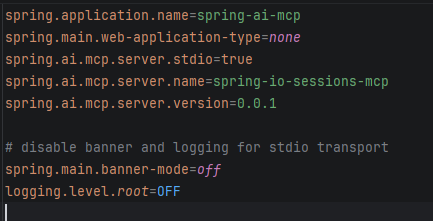
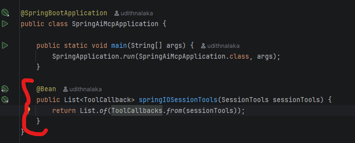
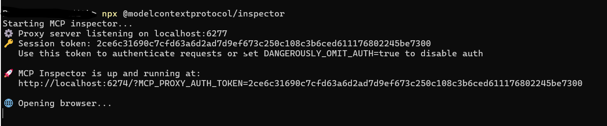
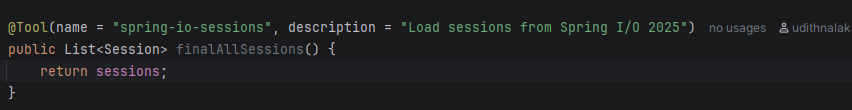
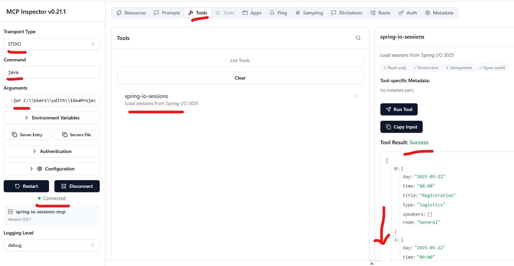

# MCP -  Getting Started

### MCP - Model Context Protocol

It is a protocol that lets AI models access tools and data sources in a standardized way.
Instead of custom integrations, MCP allows models to connect to tools via a common interface.

**MCP becomes useful when:**

* many tools exist
* many agents exist
* systems are distributed

### Example 1 - Spring I/O session info

* application.properties file

  

* Load the Tools available, In this case the SessionTools class

  

* Implement the SessionTools logic

  **SessionTools** contain the information about the spring I/O 2025 session details. It will read the sessions.json file and 
load to the List for further use. When the user asks a question related to the Spring I/O sessions, the LLM will refer 
to the sessions loaded to get an accurate answer.

* run the MCP server and test the Tool data

  Can use the MCP Inspector tool to run an MCP Server locally and test the application.
use the following link to get more details and run the command to run the inspector.

  https://modelcontextprotocol.io/docs/tools/inspector
    

      run the inspector: 
       npx @modelcontextprotocol/inspector

   

* Access the MCP inspector and check if the sessions are loaded.
  
  Connect to the MCP inspector by running below command in the MCP Inspector tool.

      java -jar <path to the app jar file>

  Open the Tools tab and load the tools available. this will show the registered tool with the given name in the @Tool annotation.

  

  Click the **Run Tool** button will display the sessions

  

